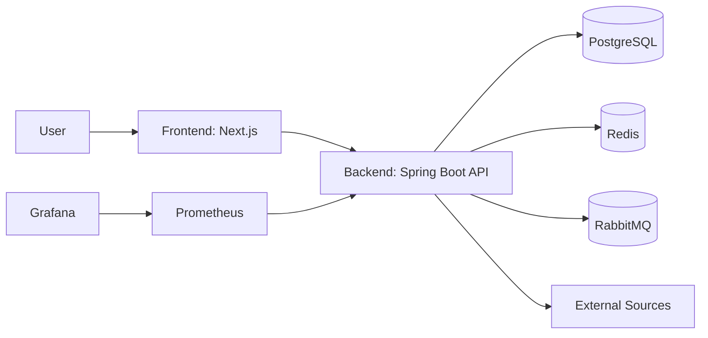

# StackScout Architecture

Архитектурное описание системы и границ компонентов.

---

## Содержание

- [Системный обзор](#системный-обзор)
- [Контейнерная схема](#контейнерная-схема)
- [Ключевые потоки](#ключевые-потоки)
- [Backend слои](#backend-слои)
- [Frontend границы](#frontend-границы)
- [Нефункциональные требования](#нефункциональные-требования)
- [Ссылки](#ссылки)

---

## Системный обзор

StackScout состоит из трех доменов:

- frontend (Next.js): UI и пользовательские сценарии;
- backend (Spring Boot): API, бизнес-логика, обработка данных;
- infrastructure: БД, кэш, очередь и мониторинг.

---

## Контейнерная схема

---

## Ключевые потоки

### Чтение данных библиотек

1. Пользователь запрашивает данные из frontend.
2. Backend валидирует запрос и читает данные из PostgreSQL.
3. При наличии кэша используется Redis.
4. Frontend рендерит результат.

### Фоновое обновление данных

1. Планировщик инициирует задачу сбора.
2. Backend читает внешние источники.
3. Данные нормализуются и сохраняются.
4. Метрики публикуются в мониторинг.

---

## Backend слои

- API слой: контроллеры, DTO, ошибки.
- Service слой: бизнес-правила и оркестрация.
- Repository слой: доступ к данным.
- Integration слой: внешние API, очередь, кэш.

Подробности: [Backend README](../backend/README.md).

---

## Frontend границы

- страницы и layout в `app/`;
- UI-компоненты в `components/`;
- сервисы и хуки в `lib/`.

Подробности: [Frontend README](../frontend/README.md).

---

## Нефункциональные требования

- Наблюдаемость: метрики и дашборды.
- Масштабируемость: разделение по сервисным ролям и очередям.
- Надежность: идемпотентные операции и ретраи.
- Безопасность: валидация входных данных и политика доступа.

---

## Ссылки

- [Root README](../README.md)
- [API](./API.md)
- [Database](./DATABASE.md)
- [Infrastructure](../infrastructure/README.md)
