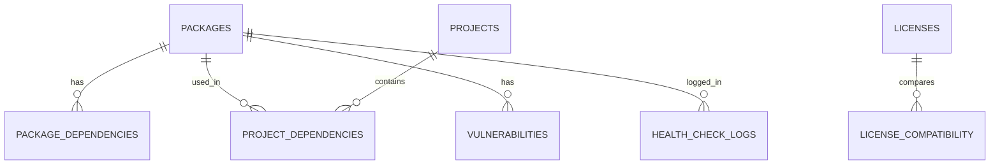

# StackScout Database

Документ по модели данных и миграциям backend.

---

## Содержание

- [Назначение](#назначение)
- [Ключевые сущности](#ключевые-сущности)
- [Связи](#связи)
- [Миграции](#миграции)
- [Правила изменений схемы](#правила-изменений-схемы)
- [Ссылки](#ссылки)

---

## Назначение

Этот документ фиксирует модель данных на уровне домена.

Исполняемой спецификацией являются SQL-миграции в backend. Приоритет у миграций.

---

## Ключевые сущности

- `packages`: каталог библиотек и health-метрики.
- `licenses`: нормализованные лицензии.
- `license_compatibility`: матрица совместимости лицензий.
- `projects`: проекты пользователей.
- `project_dependencies`: зависимости проектов.
- `package_dependencies`: граф зависимостей библиотек.
- `vulnerabilities`: данные по уязвимостям.
- `health_check_logs`: история расчетов health score.

---

## Связи

---

## Миграции

Путь к миграциям:

- `backend/src/main/resources/db/migration/`

Правила:

- одна миграция = одно изменение схемы;
- имя файла с префиксом версии `V<номер>__<описание>.sql`;
- миграции не редактируются после применения в shared-окружениях.

---

## Правила изменений схемы

- изменения должны быть обратно совместимыми, если это возможно;
- потенциально долгие операции выполняются отдельно от критичных релизов;
- новые индексы и ограничения сопровождаются обоснованием в PR;
- удаление колонок допускается только после этапа deprecation.